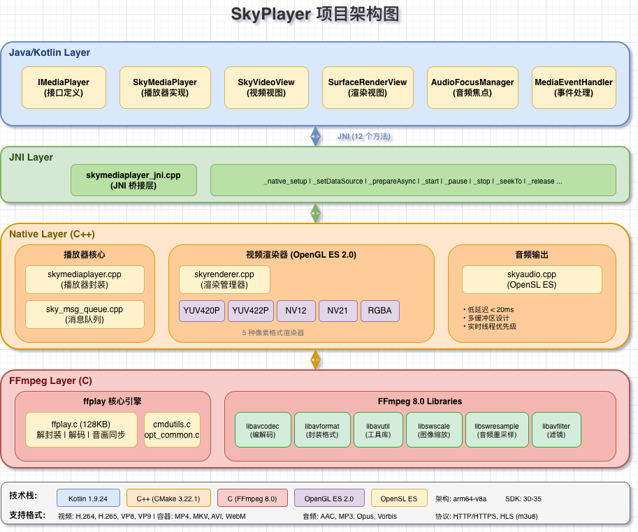

# SkyPlayer

[](https://jitpack.io/#zhiwei-wu/SkyPlayer)
[](LICENSE)
[](https://developer.android.com)
[](https://android-arsenal.com/api?level=30)

**一个基于 FFmpeg 官方 ffplay 深度改造的 Android 音视频播放器**

从 FFmpeg 8.0 的 ffplay 核心代码（126KB）改造而来，保留了经过数十年实战验证的播放逻辑，针对 Android 平台进行深度优化。不是简单的 FFmpeg 封装，而是**从解封装、解码、同步到渲染的完整实现，深入学习音视频开发的最佳实践**。

## 🌟 项目特点

#### 1. 基于 ffplay 核心改造
- **FFmpeg 8.0**：使用 FFmpeg 最新稳定版本，获得最新的格式支持和性能优化
- **保留经典架构**：完整保留 126KB 的 `ffplay.c` 播放引擎
- **经过验证的稳定性**：ffplay 作为 FFmpeg 官方播放器示例，经过数十年实战验证
- **完整的播放流程**：从解封装、解码、音画同步到渲染的全链路实现

#### 2. 针对 Android 平台深度优化
- **双渲染后端**：OpenGL ES 2.0 + Vulkan，运行时切换，5 种像素格式（YUV420P/422P、NV12/21、RGBA）
- **MediaCodec 硬件解码**：利用 SoC 专用硬件加速，CPU 占用从 100%+ 降至 5% 以下，支持 Surface 零拷贝直渲和 Buffer 输出两种模式，三级自动回退（HW_SURFACE → HW_BUFFER → SOFTWARE）保证兼容性
- **Vulkan 渲染后端**：显式控制零驱动开销、原生多线程支持、预编译 SPIR-V Shader、精确内存管理，Android 下一代图形 API
- **OpenSL ES 音频**：超低延迟音频输出（< 20ms），远优于 AudioTrack
- **安全的 JNI 设计**：线程本地存储（TLS）、自动 attach/detach、弱引用防泄漏，避免常见的 JNI 内存泄漏和崩溃问题

#### 3. 工程化设计
- **线程安全**：完整的多线程安全设计和内存管理，避免并发问题
- **错误处理**：完善的异常处理和资源释放机制，防止内存泄漏
- **消息队列**：异步事件处理，解耦播放控制和状态通知
- **RAII 机制**：使用现代 C++ 的 RAII 模式管理资源生命周期

#### 4. 清晰的架构设计
- **分层架构**：Java、JNI、Native、FFmpeg 四层清晰分离
- **C/C++ 混合编程**：使用现代 C++ 封装 C 语言的 ffplay.c，解决 C→C++ 和 C++→C 的双向调用问题，实现调用隔离和扩展性
- **JNI 安全性**：完整的线程安全机制，避免多线程环境下的崩溃和内存泄漏
- **易于理解**：每个模块职责明确，代码注释完整
- **便于扩展**：基于接口设计，支持自定义渲染器和音频输出

#### 5. Whisper AI 实时字幕
- **端侧 AI 推理**：集成 [whisper.cpp](https://github.com/ggerganov/whisper.cpp)，在设备端实时语音识别生成字幕，无需网络
- **独立解码流架构**：使用独立的 AVFormatContext 和解码器，始终比播放位置超前 5-15 秒解码音频，保证 Whisper 有充足处理时间
- **PTS 同步字幕**：字幕携带精确时间戳，基于播放主时钟进行同步展示，支持丢弃过期字幕、队列缓冲和窗口匹配
- **Seek 联动**：Seek 时自动清空字幕队列，独立解码流同步跳转，确保字幕与画面一致
- **可配置**：支持处理间隔、推理设备（CPU/GPU）、语言等参数调节

#### 6. 优秀的学习价值
- **完整的技术栈**：涵盖 FFmpeg、JNI、OpenGL ES、Vulkan、MediaCodec、OpenSL ES、Whisper AI
- **可运行的示例**：app 模块提供完整的 Demo
- **教学级代码**：适合学习音视频开发的完整实现

目前已支持本地文件播放、在线视频播放（HTTP/HTTPS/HLS）和 AI 实时字幕，直播等功能持续迭代中。

## 🏗️ 架构设计

SkyPlayer 采用清晰的分层架构设计：



### 关键模块说明

#### Java 层（`SkyMediaPlayer.kt`）
- **接口设计**：实现 `IMediaPlayer` 接口，兼容 Android MediaPlayer API
- **事件处理**：`MediaEventHandler` 处理 Native 层回调
- **生命周期管理**：正确处理 Surface、监听器等资源

#### JNI 层（`skymediaplayer_jni.cpp`）
- **方法注册**：`JNI_OnLoad` 中注册 12 个 Native 方法
- **线程安全**：TLS 管理 JNIEnv，自动 attach/detach
- **对象管理**：弱全局引用防止泄漏

#### Native 层
- **播放器核心**（`skymediaplayer.cpp`）：封装 ffplay，提供播放控制
- **渲染器**（`renderer/`）：OpenGL ES 2.0（5 种像素格式）+ Vulkan 渲染后端，工厂模式透明切换
- **硬件解码器**（`decoder/`）：MediaCodec 硬解抽象基类 + Android 实现，Surface 直渲零拷贝 + Buffer 输出双模式
- **音频输出**（`skyaudio.cpp`）：OpenSL ES 低延迟播放
- **消息队列**（`sky_msg_queue.cpp`）：异步事件处理
- **Whisper 字幕**：独立解码流超前解码 + whisper.cpp 端侧推理 + PTS 同步展示

#### FFmpeg 层
- **ffplay 核心**（`ffplay.c`）：完整的播放引擎
- **命令行工具**（`cmdutils.c`、`opt_common.c`）：参数解析和配置
- **适配层**（`sky_ffplay.c/h`）：Android 平台适配

## 🎬 支持的格式和协议

### 视频格式
- **容器格式**：MP4、AVI、MKV、WebM、MOV
- **视频编码**：H.264、H.265/HEVC、MPEG-4、MPEG-2、VP8、VP9

### 音频格式
- **音频编码**：AAC、MP3、Opus、Vorbis

### 网络协议
- **HTTP/HTTPS**：标准 HTTP(S) 视频流
- **HLS (m3u8)**：Apple HTTP Live Streaming，支持自适应码率
- **本地文件**：支持本地存储的所有支持格式

### 技术特性
- ✅ **OpenSSL 集成**：支持 HTTPS 加密传输
- ✅ **HLS 自适应码率**：根据网络状况自动切换清晰度
- ✅ **网络流缓冲**：智能缓冲策略，流畅播放
- ✅ **断点续播**：支持 Seek 到任意位置

## 📦 集成依赖

### 通过 JitPack 引入（推荐）

**Step 1.** 在项目根目录的 `settings.gradle.kts` 中添加 JitPack 仓库：

```kotlin
dependencyResolutionManagement {
    repositoriesMode.set(RepositoriesMode.FAIL_ON_PROJECT_REPOS)
    repositories {
        google()
        mavenCentral()
        maven { url = uri("https://jitpack.io") }  // 添加 JitPack
    }
}
```

**Step 2.** 在模块的 `build.gradle.kts` 中添加依赖：

```kotlin
dependencies {
    // Release 版本（生产环境，so 已 strip）
    implementation("com.github.zhiwei-wu:SkyPlayer:v1.0.0")

    // 或 Debug 版本（开发调试，so 含完整调试符号）
    // implementation("com.github.zhiwei-wu:SkyPlayer:v1.0.0")
}
```

> 💡 将 `v1.0.0` 替换为 [最新版本号](https://jitpack.io/#zhiwei-wu/SkyPlayer)，或使用 `main-SNAPSHOT` 获取最新主分支构建。

### 通过 Maven Local 引入（本地开发调试）

```bash
# 在 SkyPlayer 项目中执行，发布到本地 Maven 仓库
./gradlew :skymediaplayer:publishReleasePublicationToMavenLocal -PVERSION_NAME=1.0.0
```

然后在你的项目中：

```kotlin
// settings.gradle.kts
repositories {
    mavenLocal()
    // ...
}

// build.gradle.kts
dependencies {
    implementation("com.github.zhiwei-wu:skymediaplayer:1.0.0")
}
```

## 🚀 快速开始

### 本地视频播放

```kotlin
import imt.zw.skymediaplayer.player.SkyMediaPlayer

class MainActivity : AppCompatActivity() {
    private lateinit var player: SkyMediaPlayer
    
    override fun onCreate(savedInstanceState: Bundle?) {
        super.onCreate(savedInstanceState)
        
        // 创建播放器实例
        player = SkyMediaPlayer()
        
        // 设置本地视频路径
        player.setDataSource("/sdcard/Movies/video.mp4")
        
        // 设置渲染 Surface
        player.setSurface(surfaceView.holder.surface)
        
        // 设置事件监听
        player.setOnPreparedListener {
            // 准备完成，开始播放
            player.start()
        }
        
        player.setOnErrorListener { _: IMediaPlayer, what: Int, extra: Int ->
            Log.e("Player", "Error: what=$what, extra=$extra")
            true
        }
        
        // 异步准备
        player.prepareAsync()
    }
    
    override fun onDestroy() {
        super.onDestroy()
        player.release()
    }
}
```

### 在线视频播放

```kotlin
// HTTP/HTTPS 视频
player.setDataSource("https://example.com/video.mp4")

// HLS 直播流
player.setDataSource("https://example.com/live/stream.m3u8")

// 设置其他参数与本地播放相同
player.setSurface(surfaceView.holder.surface)
player.setOnPreparedListener {
    player.start()
}
player.prepareAsync()
```

### 播放控制

```kotlin
// 播放
player.start()

// 暂停
player.pause()

// 停止
player.stop()

// 跳转到指定位置（毫秒）
player.seekTo(30000) // 跳转到 30 秒

// 获取当前播放位置
val position = player.currentPosition

// 获取视频总时长
val duration = player.duration

// 设置音量（0.0 - 1.0）
player.setVolume(0.5f, 0.5f)

// 静音
player.setMute(true)
```

### 事件监听

```kotlin
// 准备完成监听
player.setOnPreparedListener {
    Log.d("Player", "准备完成")
}

// 播放完成监听
player.setOnCompletionListener {
    Log.d("Player", "播放完成")
}

// 错误监听
player.setOnErrorListener { _: IMediaPlayer, what: Int, extra: Int ->
    Log.e("Player", "播放错误: what=$what, extra=$extra")
    true // 返回 true 表示已处理错误
}

// 缓冲更新监听
player.setOnBufferingUpdateListener { mp: IMediaPlayer, percent: Int ->
    Log.d("Player", "缓冲进度: $percent%")
}

// Seek 完成监听
player.setOnSeekCompleteListener {
    Log.d("Player", "Seek 完成")
}
```

## 🔧 编译说明

### 环境要求

- Android Studio Arctic Fox 或更高版本
- NDK 21.0 或更高版本
- CMake 3.22.1 或更高版本
- Gradle 8.0 或更高版本

### 编译步骤

1. 克隆仓库
```bash
git clone https://github.com/zhiwei-wu/SkyPlayer.git
cd SkyPlayer
```

2. 打开项目
使用 Android Studio 打开项目

3. 编译 aar，集成到你的项目
```bash
./gradlew :skymediaplayer:assembleRelease
```

### FFmpeg 编译配置

本项目使用定制编译的 FFmpeg，支持以下特性：

#### 网络支持
- **OpenSSL 集成**：支持 HTTPS 加密传输
- **网络协议**：HTTP、HTTPS、TCP、UDP、RTP、RTSP、HLS
- **流媒体格式**：HLS (m3u8)、MPEG-TS

#### 编译配置要点

```bash
# 启用网络支持
--enable-network

# 启用 OpenSSL（HTTPS 支持）
--enable-openssl

# 支持的解封装器
--enable-demuxer=mov,mp4,avi,matroska,webm,hls,mpegts

# 支持的网络协议
--enable-protocol=file,http,https,tcp,udp,rtp,rtsp,hls

# OpenSSL 链接
--extra-cflags="-I$OPENSSL_DIR/include"
--extra-ldflags="-L$OPENSSL_DIR/lib"
# 静态链接 libssl.a 和 libcrypto.a
```

详细的编译脚本请参考：[build_skyplayer_ffmpeg.sh](https://github.com/zhiwei-wu/FFmpeg/blob/main/build_skyplayer_ffmpeg.sh)

#### 关键配置变更

**提交**: `f1b2f39` - 支持 http,https,hls 协议

主要变更：
1. **启用网络支持**：`--enable-network`
2. **集成 OpenSSL**：`--enable-openssl`
3. **新增 HLS 支持**：`--enable-demuxer=hls,mpegts`
4. **扩展网络协议**：`--enable-protocol=http,https,tcp,udp,rtp,rtsp,hls`
5. **链接 OpenSSL 库**：静态链接 `libssl.a` 和 `libcrypto.a`

## 📱 示例应用

项目包含一个完整的示例应用（`app` 模块），展示了如何使用 SkyPlayer：

- 基本播放功能
- 播放控制（播放、暂停、停止、Seek）
- 播放状态显示
- 错误处理

## 📄 许可证

本项目采用 MIT 许可证 - 详见 [LICENSE](LICENSE) 文件

## 👨‍💻 作者

**Wu Zhiwei**
- GitHub: [@zhiwei-wu](https://github.com/zhiwei-wu)
- Email: zhiwei.wu@foxmail.com

## 🎯 路线图

### 已完成 ✅
- [x] 基于 ffplay 的核心播放引擎
- [x] 5 种像素格式的硬件加速渲染
- [x] OpenSL ES 低延迟音频输出
- [x] 完整的 JNI 线程安全设计
- [x] 本地文件播放支持
- [x] 播放控制（播放、暂停、Seek）
- [x] 事件回调机制
- [x] **在线视频播放（HTTP/HTTPS）** 🎉
- [x] **HLS 直播流支持（m3u8）** 🎉
- [x] **OpenSSL 集成（HTTPS 加密传输）** 🎉
- [x] **Whisper AI 实时字幕（端侧推理、PTS 同步）** 🎉
- [x] **MediaCodec 硬件解码（三级回退：HW_SURFACE → HW_BUFFER → SOFTWARE）** 🎉
- [x] **Vulkan 渲染后端（预编译 SPIR-V Shader、双缓冲同步）** 🎉
- [x] **Surface 直渲音画同步（两步解耦：dequeueFrame → renderOutputBuffer）** 🎉

### 进行中 🚧
- [ ] RTMP 直播流支持
- [ ] 播放列表管理
- [ ] 网络状态监控和自适应

### 计划中 📋
- [ ] 倍速播放
- [ ] 截图功能
- [ ] 视频录制
- [ ] 更多音视频格式支持
- [ ] RTSP 流支持

## 🙏 致谢

- [FFmpeg](https://ffmpeg.org/) - 强大的多媒体处理库
- [ffplay](https://ffmpeg.org/ffplay.html) - FFmpeg 的播放器示例，本项目的核心基础
- [ijkplayer](https://github.com/bilibili/ijkplayer) - Bilibili 开源的基于 FFmpeg 的播放器，提供了重要的实现参考
- [SDL](https://www.libsdl.org/) - Simple DirectMedia Layer，ffplay 的原始渲染层
- [Vulkan](https://www.vulkan.org/) - 下一代图形 API
- [Android NDK MediaCodec](https://developer.android.com/ndk/reference/group/media) - 硬件解码接口

## 🌟 Star History

如果这个项目对你有帮助，请给个 Star ⭐️

[](https://star-history.com/#zhiwei-wu/SkyPlayer&Date)

---

**Made with ❤️ by Wu Zhiwei**
