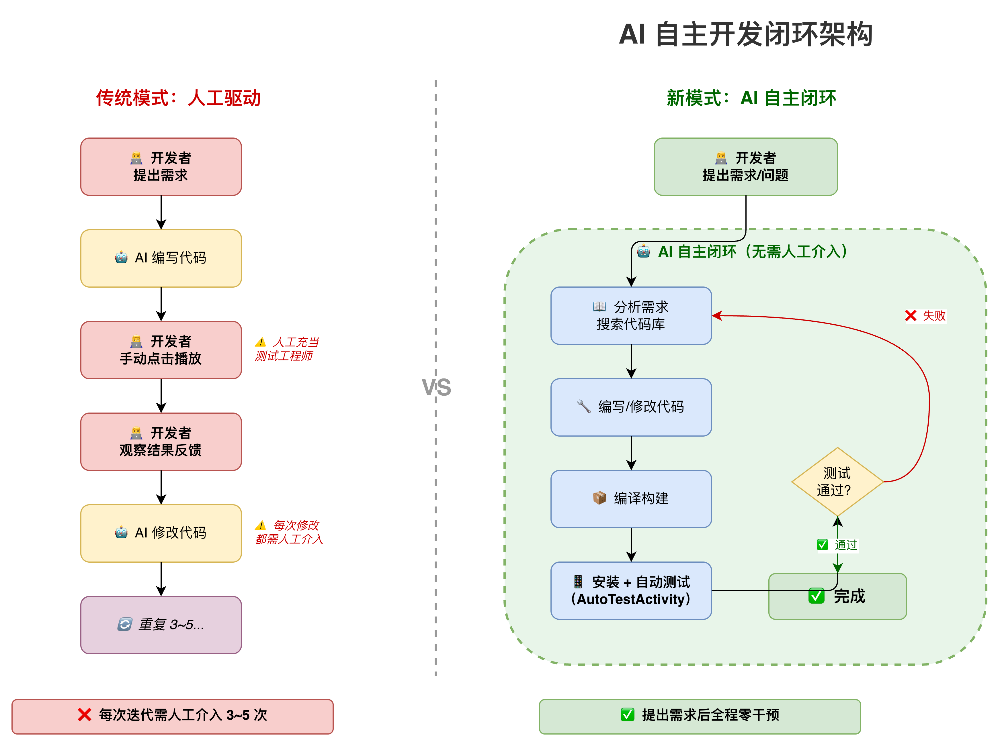
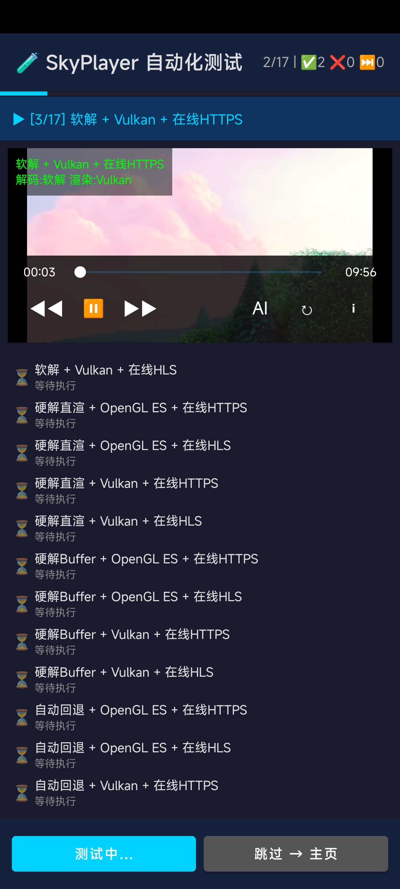
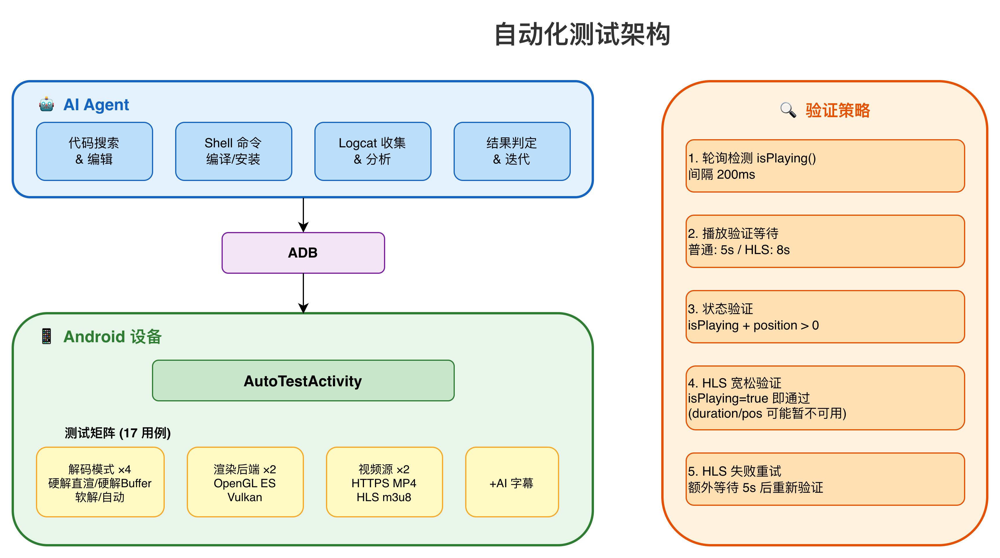
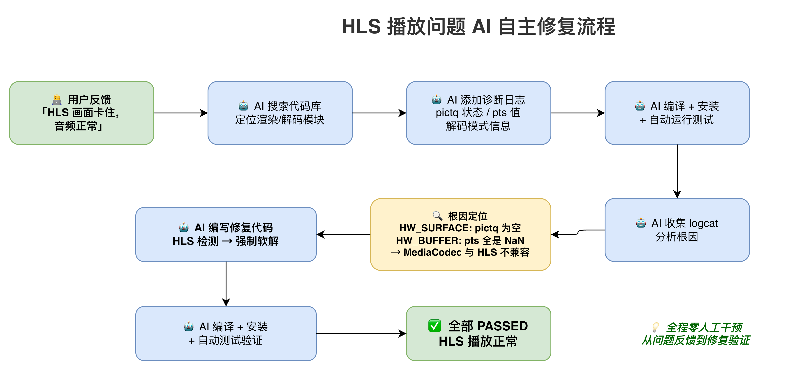

# AI 驱动的自主开发闭环：从"人工测试员"到"需求驱动"的转变

## 背景

在 SkyPlayer 的开发过程中，AI 编程助手已经深度参与了代码编写、架构设计、问题排查等工作。然而，在之前的协作模式中，存在一个明显的效率瓶颈：

**每次 AI 修改代码后，都需要开发者手动操作设备来验证结果。**

开发者实际上充当了 AI 的"测试工程师"——点击播放按钮、观察画面、反馈结果。这种模式下，一个问题的修复往往需要 3~5 轮人工介入，严重拖慢了开发节奏。

> 架构对比图见：[ai_auto_dev.drawio](ai_auto_dev.drawio)（第 1 页：AI 自主开发闭环）



**实际效果截图：**



## 核心思路：让 AI 拥有"眼睛"和"手"

要实现 AI 自主闭环开发，关键是补齐两个能力：

1. **"手"**：AI 能自动编译、安装、启动应用并触发测试
2. **"眼睛"**：AI 能自动收集测试结果（logcat 日志），判断功能是否正常

### 解决方案：自动化测试框架

我们在示例应用中新增了 `AutoTestActivity`，它是一个全自动的播放器功能验证页面：

- **应用启动后自动进入测试页面**，无需手动导航
- **自动遍历所有测试用例**，覆盖解码模式、渲染后端、视频源的完整组合
- **自动判定测试结果**，通过 logcat 输出标准化的 PASSED/FAILED 日志
- **AI 通过 ADB 收集日志**，即可判断功能是否正常

> 架构图见：[ai_auto_dev.drawio](ai_auto_dev.drawio)（第 3 页：自动化测试架构）



### 测试矩阵

| 维度 | 选项 | 说明 |
|------|------|------|
| 解码模式 | 硬解直渲 / 硬解Buffer / 软解 / 自动 | 4 种解码策略 |
| 渲染后端 | OpenGL ES / Vulkan | 2 种 GPU 渲染方式 |
| 视频源 | HTTPS MP4 / HLS m3u8 | 2 种网络协议 |
| AI 字幕 | Whisper 实时识别 | 端侧 AI 推理 |

**总计 17 个测试用例**（4×2×2 = 16 + 1 AI 字幕），全自动执行，无需任何人工操作。

### HLS 智能验证策略

HLS 流的特殊性在于起播慢（需下载 m3u8 索引 + 首个 TS 分片），因此验证策略做了针对性优化：

| 策略 | 普通视频 | HLS 流 |
|------|---------|--------|
| 准备超时 | 20 秒 | 45 秒 |
| 播放验证等待 | 5 秒 | 8 秒 |
| 验证条件 | isPlaying + position > 0 | isPlaying 即通过（duration/position 可能暂不可用） |
| 失败重试 | 无 | 额外等待 5 秒后重试 |

## 实战案例：HLS 视频画面卡住问题的自主修复

这是一个完整的 AI 自主闭环修复案例，展示了从问题反馈到修复验证的全过程。

> 修复流程图见：[ai_auto_dev.drawio](ai_auto_dev.drawio)（第 2 页：HLS 问题修复流程）



### 问题描述

用户反馈：
> "HLS 播放的确有问题：画面卡住没有继续播放，但音频输出正常；如果进行 seek，只会播放一小段，然后画面又卡住不继续刷新渲染了。"

### AI 自主排查过程

#### 第一步：搜索代码库，定位相关模块

AI 自动搜索了视频渲染、解码、音画同步相关的代码模块，锁定了 `ffplay.c` 中的视频刷新逻辑（`video_refresh`）和解码器初始化逻辑（`stream_component_open`）。

#### 第二步：添加诊断日志

AI 在关键路径上添加了诊断日志：
- `pictq`（视频帧队列）的状态：是否为空、帧数量
- `videoq`（视频包队列）的状态：包数量
- 解码帧的 `pts` 值
- 当前使用的解码模式

#### 第三步：编译 → 安装 → 自动测试

```bash
# AI 自动执行
./gradlew :app:installDebug
adb shell am start -n imt.skymediaplayer.demo/.MainActivity
# 等待自动测试完成
adb logcat -s AutoTestActivity | grep -E "PASS|FAIL"
```

#### 第四步：收集日志，分析根因

AI 从 logcat 中发现了关键线索：

**HW_SURFACE 模式（硬解直渲）：**
```
pictq EMPTY count=301 videoq.nb_packets=26
```
视频包队列有 26 个包，但帧队列始终为空——解码线程卡住了。

**HW_BUFFER 模式（硬解 Buffer）：**
```
rendered pts=nan
```
帧虽然入队了，但 pts 全是 NaN——时间戳丢失，音画同步失效。

#### 第五步：定位根因

**根因**：Android MediaCodec 硬件解码器与 HLS 流的分片切换机制不兼容。

HLS 流的特点是由多个 TS 分片组成，播放过程中会频繁切换分片。每次切换时：
- 编解码器参数可能发生变化
- 时间戳基准可能重置
- MediaCodec 的内部状态可能异常

这导致了两种硬解模式都出现问题：
- **HW_SURFACE**：MediaCodec 解码线程卡死，无法产出帧
- **HW_BUFFER**：帧产出但时间戳信息丢失

#### 第六步：编写修复代码

AI 在 `ffplay.c` 的 `stream_component_open` 函数中添加了 HLS 流检测和软解回退逻辑：

```c
// HLS 流检测：URL 包含 .m3u8 或格式名包含 hls/applehttp
int is_hls = 0;
if (is->filename && strstr(is->filename, ".m3u8")) {
    is_hls = 1;
} else if (ic->iformat && ic->iformat->name &&
           (strstr(ic->iformat->name, "hls") ||
            strstr(ic->iformat->name, "applehttp"))) {
    is_hls = 1;
}

// HLS 流强制使用软解，避免硬件解码器兼容性问题
if (is_hls && decoder_mode != SKY_DECODER_MODE_SOFTWARE) {
    decoder_mode = SKY_DECODER_MODE_SOFTWARE;
}
```

#### 第七步：编译 → 安装 → 自动验证

AI 再次执行编译安装，自动测试框架自动运行所有 17 个用例：

```
Test result [PASSED]: 软解 + OpenGL ES + 在线HLS
Test result [PASSED]: 软解 + Vulkan + 在线HLS
Test result [PASSED]: 硬解直渲 + OpenGL ES + 在线HLS  (实际软解回退)
Test result [PASSED]: 硬解直渲 + Vulkan + 在线HLS     (实际软解回退)
...
```

**全部 PASSED**，问题修复完成。

### 关键数据

| 指标 | 传统模式（估算） | AI 自主闭环 |
|------|----------------|------------|
| 人工介入次数 | 5~8 次 | **1 次**（仅提出问题） |
| 修复周期 | 2~4 小时 | **约 30 分钟** |
| 验证覆盖度 | 手动测试 1~2 种配置 | **自动覆盖 17 种配置** |

## 工作模式的转变

### 之前：开发者 = AI 的测试工程师

```
开发者提需求 → AI 写代码 → 开发者手动测试 → 开发者反馈结果 → AI 改代码 → 开发者再测 → ...
```

每一轮迭代都需要开发者：
1. 等待编译完成
2. 手动安装到设备
3. 打开应用，导航到播放页面
4. 点击播放，观察画面
5. 将观察结果描述给 AI

### 现在：开发者 = 需求提出者

```
开发者提出需求/问题 → AI 自主完成全部工作 → 开发者确认结果
```

AI 自主完成的工作包括：
1. **搜索代码库**，理解现有架构
2. **编写/修改代码**，实现功能或修复问题
3. **执行编译构建**（`./gradlew installDebug`）
4. **安装到设备**（`adb install`）
5. **触发自动测试**（`AutoTestActivity` 自动运行）
6. **收集测试日志**（`adb logcat`）
7. **分析结果**，判断是否通过
8. **如果失败，自动迭代**修复

开发者只需要做一件事：**描述需求或问题**。

## 技术实现要点

### 自动化测试框架（AutoTestActivity）

**核心设计**：
- 应用启动时自动进入测试页面（`MainActivity` 作为启动 Activity，自动跳转）
- 测试用例以矩阵方式组织，自动遍历所有组合
- 每个用例独立运行：释放旧播放器 → 配置参数 → 播放 → 验证 → 记录结果
- 通过 `Log.i(TAG, "Test result [PASSED/FAILED]: ...")` 输出标准化日志

**关键代码路径**：
- `app/src/main/java/imt/skymediaplayer/demo/AutoTestActivity.kt`
- `app/src/main/res/layout/activity_auto_test.xml`

### HLS 软解回退

**核心设计**：
- 在 FFmpeg 的 `stream_component_open` 中检测 HLS 流
- 检测方式：URL 包含 `.m3u8` 或 `AVInputFormat.name` 包含 `hls`/`applehttp`
- 检测到 HLS 流时，强制将解码模式设为 `SKY_DECODER_MODE_SOFTWARE`
- 对用户透明：上层仍可设置任意解码模式，底层自动回退

**关键代码路径**：
- `skymediaplayer/src/main/cpp/ffplay/ffplay.c`（`stream_component_open` 函数）

### AI Agent 的工具链

AI 通过以下工具链实现自主闭环：

| 工具 | 用途 |
|------|------|
| `codebase_search` | 语义搜索代码库，定位相关模块 |
| `read_file` | 读取源码，理解实现细节 |
| `file_replace` | 精确修改代码 |
| `launch-process` | 执行 shell 命令（编译、安装、收集日志） |
| `read-process` | 读取命令输出（logcat 日志分析） |

## 总结

通过引入自动化测试框架，我们实现了 AI 开发的关键闭环：

1. **AI 拥有了"手"**：通过 ADB 命令自动编译、安装、启动应用
2. **AI 拥有了"眼睛"**：通过 logcat 日志自动判断功能是否正常
3. **开发者角色转变**：从"AI 的测试工程师"变为"需求提出者"
4. **效率提升**：人工介入从 5~8 次降至 1 次，验证覆盖度从 1~2 种提升到 17 种

这不仅是一个技术改进，更是一种 **AI 辅助开发工作模式的升级**——让 AI 真正具备了端到端的自主开发能力。
