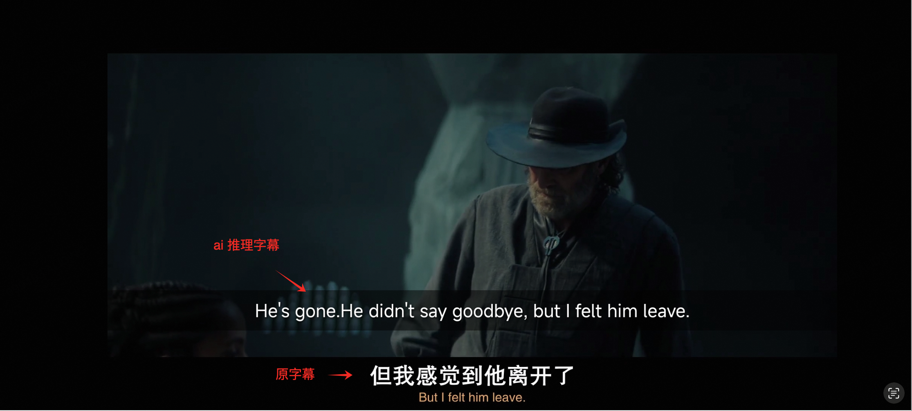
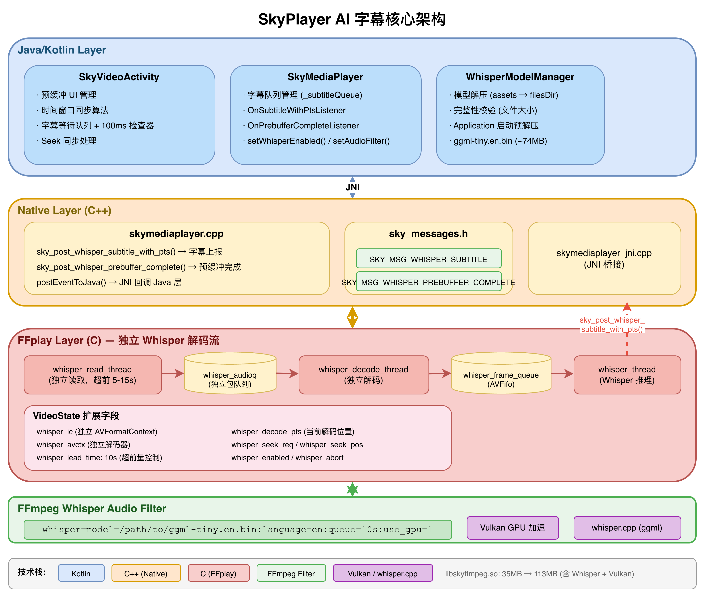
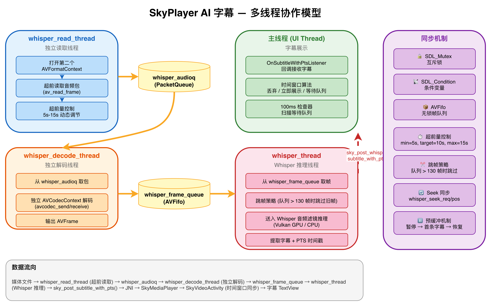
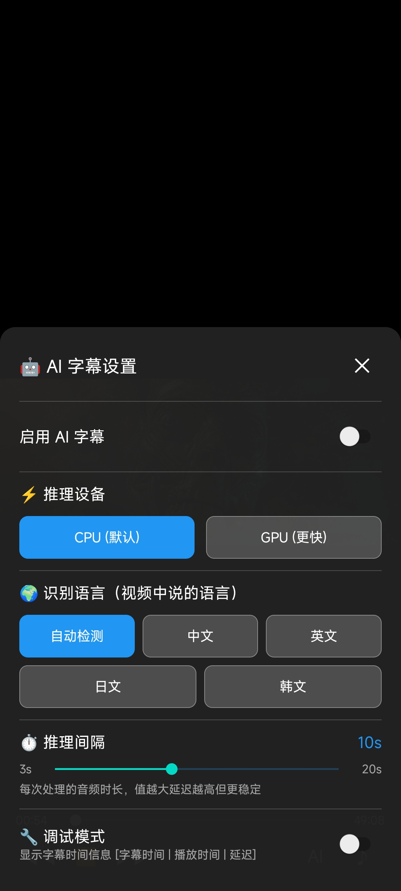

# SkyPlayer AI 字幕：端侧 Whisper 实时语音识别实践

## 前言

本次分享介绍 SkyPlayer 如何在 Android 端集成 **OpenAI Whisper** 语音识别模型，实现**实时 AI 字幕**功能——无需服务端、无需网络，纯端侧推理，从音频解码到字幕展示的完整链路。

### 目录

- [一、整体方案概览](#一整体方案概览) — 技术选型与核心架构
- [二、核心技术点](#二核心技术点) — 独立解码流、FFmpeg 音频滤镜、多线程模型、跳帧策略
- [三、字幕同步：时间窗口算法](#三字幕同步时间窗口算法) — PTS 同步、等待队列、Seek 联动
- [四、预缓冲机制](#四预缓冲机制) — 暂停-预缓冲-恢复策略
- [五、消息通信机制](#五消息通信机制) — Native → JNI → Kotlin 全链路消息流转
- [六、模型管理](#六模型管理) — 模型选择、生命周期、预解压
- [七、字幕设置面板](#七字幕设置面板) — UI 设计、设置数据模型、调试模式
- [八、性能与体积分析](#八性能与体积分析) — SO 体积、模型文件、运行时内存
- [九、代码变更统计](#九代码变更统计) — 49 个文件，9500+ 行代码
- [十、总结与展望](#十总结与展望) — 已实现功能与后续优化方向

### 效果预览



---

## 一、整体方案概览

### 1.1 技术选型

| 维度 | 选型 | 理由 |
|------|------|------|
| **语音识别模型** | OpenAI Whisper (ggml-tiny.en) | 轻量（~74MB），端侧可用，多语言支持 |
| **推理框架** | whisper.cpp (ggml) | C/C++ 实现，支持 Vulkan GPU 加速 |
| **集成方式** | FFmpeg 自定义音频滤镜 | 复用 FFmpeg 音频处理管线，零拷贝 |
| **GPU 加速** | Vulkan 后端 | Android 原生支持，无需 OpenCL 驱动 |
| **字幕同步** | PTS 时间戳 + 时间窗口算法 | 精确的音画同步，避免字幕提前/滞后 |

### 1.2 核心架构

> 📎 完整架构图见 [ai_subtitle_architecture.drawio](ai_subtitle_architecture.drawio)，可用 draw.io 打开编辑。



**一句话总结**：Whisper 使用**独立的读取线程和解码线程**，与主播放解码完全分离，始终超前播放位置 5-15 秒解码音频，确保字幕提前生成，再通过时间窗口算法精确同步展示。

---

## 二、核心技术点

### 2.1 独立解码流：超前解码架构

这是整个方案**最核心**的设计决策。

#### 为什么不直接复用主播放器的音频解码数据？

**问题**：Whisper 推理一段 10 秒音频需要 2-5 秒（取决于设备性能）。如果等主播放器解码到某个位置再送入 Whisper，字幕必然延迟 2-5 秒才能出现，用户体验很差。

**解决方案**：打开同一个媒体文件的**第二个 AVFormatContext**，用独立线程超前读取和解码音频：

```c
// VideoState 中的独立解码流字段
struct VideoState {
    // 独立的格式上下文和解码器（与主播放器完全隔离）
    AVFormatContext *whisper_ic;           // 第二个文件句柄
    AVCodecContext  *whisper_avctx;        // 独立的音频解码器
    PacketQueue      whisper_audioq;       // 独立的音频包队列
    int              whisper_audio_stream; // 音频流索引

    // 独立的线程
    SDL_Thread *whisper_read_tid;          // 独立的读取线程
    SDL_Thread *whisper_decode_tid;        // 独立的解码线程

    // 超前量控制
    double whisper_lead_time;              // 目标超前 10 秒
    double whisper_min_lead_time;          // 最小超前 5 秒
    double whisper_max_lead_time;          // 最大超前 15 秒
    volatile int64_t whisper_decode_pts;   // 当前解码位置
};
```

#### 超前量控制策略

| 当前超前量 | 行为 | 说明 |
|-----------|------|------|
| > 15 秒 | 暂停读取 | 等待主播放器追上，避免内存浪费 |
| 5-15 秒 | 正常速度读取 | 理想工作区间 |
| < 5 秒 | 加速读取 | 尽快补充缓冲，防止字幕断档 |

这样当用户播放到某个时间点时，该时间点的字幕早已生成完毕，可以立即展示，实现"零延迟"的用户体验。

### 2.2 FFmpeg 自定义 Whisper 音频滤镜

Whisper 推理被封装为 FFmpeg 的**音频滤镜**（Audio Filter），通过滤镜参数字符串配置：

```
whisper=model=/data/app/whisper/ggml-tiny.en.bin:language=en:queue=10s:use_gpu=1
```

| 参数 | 含义 | 默认值 |
|------|------|--------|
| `model` | 模型文件路径 | 必填 |
| `language` | 识别语言（en/zh/ja/ko） | en |
| `queue` | 每次处理的音频时长 | 10s |
| `use_gpu` | 是否启用 Vulkan GPU 加速 | 1 |

#### 为什么选择滤镜方式集成？

1. **复用重采样管线**：Whisper 需要 16kHz 单声道输入，滤镜链自动完成格式转换，无需手动处理
2. **零拷贝**：音频帧直接在 FFmpeg 内部流转，无需跨层数据拷贝
3. **热插拔**：通过 `set_audio_filters()` 动态启用/禁用，无需重启播放器

```c
// 动态设置音频滤镜
int set_audio_filters(VideoState *is, const char *filters) {
    // 如果检测到 whisper 滤镜，直接启动 Whisper 线程
    if (filters && contains_whisper_filter(filters)) {
        if (!is->whisper_tid) {
            start_whisper_thread(is);
        }
    }
    // ...
}
```

### 2.3 多线程协作模型

整个 AI 字幕功能涉及 **4 个独立线程**，各司其职：

> 📎 完整线程模型图见 [ai_subtitle_architecture.drawio](ai_subtitle_architecture.drawio)（Thread Model 页），可用 draw.io 打开编辑。



- **whisper_read_thread**（独立读取线程）：打开同一个文件的第二个 AVFormatContext，超前读取音频包放入 `whisper_audioq`，根据超前量动态调节读取速度
- **whisper_decode_thread**（独立解码线程）：从 `whisper_audioq` 取包，用独立的 AVCodecContext 解码，解码后的 AVFrame 放入 `whisper_frame_queue`
- **whisper_thread**（Whisper 推理线程）：从 `whisper_frame_queue` 取帧，送入 Whisper 音频滤镜推理，提取字幕文本 + PTS 时间戳，调用 `sky_post_whisper_subtitle_with_pts()` 上报
- **主线程 (UI)**（字幕展示）：回调接收字幕，时间窗口算法判断展示时机，更新 TextView 显示字幕

线程间通过 **互斥锁 + 条件变量** 同步，使用 **AVFifo 队列** 传递数据，避免锁竞争。

### 2.4 跳帧策略

当设备性能不足导致 Whisper 处理队列积压时，自动跳过旧帧，保证实时性：

```c
const size_t SKIP_THRESHOLD = 130;  // 约 3 秒的音频帧

if (queue_size > SKIP_THRESHOLD) {
    size_t frames_to_skip = queue_size - SKIP_THRESHOLD;
    // 跳过旧帧，只处理最新的音频
}
```

这保证了即使在低端设备上，字幕也不会无限延迟，而是优雅降级——跳过一些片段，但保持实时性。

---

## 三、字幕同步：时间窗口算法

> 📎 完整字幕同步流程图见 [ai_subtitle_architecture.drawio](ai_subtitle_architecture.drawio)（Subtitle Sync 页），可用 draw.io 打开编辑。


### 3.1 为什么需要时间窗口？

由于 Whisper 是**超前解码**的，字幕生成时间早于实际播放时间。如果收到字幕就立即显示，会导致字幕提前出现，与画面不同步。

反过来，如果 Whisper 处理较慢，字幕可能晚于播放位置到达，此时需要判断是否还有展示价值。

### 3.2 算法设计

每条字幕携带精确的 PTS 时间戳（`startTimeMs`, `endTimeMs`），UI 层收到字幕后，根据当前播放位置判断处理策略：

```
设 interval = 推理间隔（默认 10 秒）

当收到字幕 (text, startTimeMs, endTimeMs) 时：
│
├─ 计算时间窗口：
│   windowStart = startTimeMs - interval/2
│   windowEnd   = startTimeMs + interval/2
│   discardLine = startTimeMs + interval
│
├─ 情况 1：discardLine < currentPos
│   → 字幕太旧，丢弃 🗑️
│
├─ 情况 2：currentPos ∈ [windowStart, windowEnd]
│   → 正好在窗口内，立即展示 ✅
│
├─ 情况 3：startTimeMs > currentPos + interval/2
│   → 字幕超前，加入等待队列 ⏳
│   → 启动 100ms 定时检查器
│
└─ 情况 4：其他
    → 直接展示 ✅
```

用表格总结：

| 条件 | 判断公式 | 处理方式 |
|------|----------|----------|
| **立即展示** | `currentPos ∈ [startTime - interval/2, startTime + interval/2]` | 直接显示 |
| **丢弃** | `startTime + interval < currentPos` | 字幕太旧，丢弃 |
| **等待** | `startTime > currentPos + interval/2` | 加入队列，等待展示 |

### 3.3 等待队列机制

超前的字幕不会丢失，而是存入按时间排序的等待队列：

```kotlin
private data class PendingSubtitle(
    val text: String,
    val startTimeMs: Long,
    val endTimeMs: Long
)

// 按 startTimeMs 排序的等待队列
private val pendingSubtitleQueue = mutableListOf<PendingSubtitle>()
```

一个 **100ms 周期的检查器** 持续扫描队列：

```kotlin
private fun startSubtitleQueueChecker(player: IMediaPlayer) {
    subtitleCheckRunnable = object : Runnable {
        override fun run() {
            val currentPosMs = player.getCurrentPosition()

            synchronized(pendingSubtitleQueue) {
                val iterator = pendingSubtitleQueue.iterator()
                while (iterator.hasNext()) {
                    val subtitle = iterator.next()
                    when {
                        // 字幕已过期，丢弃
                        discardThreshold < currentPosMs -> iterator.remove()
                        // 字幕到达展示时间窗口，展示并移除
                        currentPosMs in windowStart..windowEnd -> {
                            displaySubtitle(subtitle.text, subtitle.startTimeMs, currentPosMs)
                            iterator.remove()
                        }
                    }
                }
                // 队列清空后检查器自动停止，节省资源
                if (pendingSubtitleQueue.isEmpty()) {
                    subtitleCheckRunnable = null
                    return
                }
            }
            subtitleHandler.postDelayed(this, 100L)
        }
    }
    subtitleHandler.post(subtitleCheckRunnable!!)
}
```

### 3.4 Seek 同步

用户拖动进度条时，需要多层同步处理：

```
用户拖动进度条
    │
    ▼
① 清空字幕等待队列（旧位置的字幕全部作废）
② 停止字幕队列检查器
③ 显示"字幕加载中..."提示
    │
    ▼
④ 主播放器 Seek 到新位置
⑤ Whisper 独立解码流同步 Seek
    │
    ▼
⑥ 收到新位置的第一条字幕
⑦ 清除"字幕加载中..."状态
⑧ 恢复正常字幕展示
```

```kotlin
override fun onSeekComplete(mp: IMediaPlayer) {
    if (!isSubtitleSyncEnabled) return

    // 清空字幕等待队列
    synchronized(pendingSubtitleQueue) { pendingSubtitleQueue.clear() }

    // 停止字幕队列检查器
    subtitleCheckRunnable?.let { subtitleHandler.removeCallbacks(it) }
    subtitleCheckRunnable = null

    // 显示"字幕加载中..."提示
    isWaitingForSubtitleAfterSeek = true
    runOnUiThread { mSkyVideoView.setSubtitleText("字幕加载中...") }
}
```

---

## 四、预缓冲机制

### 4.1 问题

用户点击"开启 AI 字幕"后，Whisper 需要几秒钟才能生成第一条字幕。如果此时视频继续播放，前几秒就没有字幕，体验不好。

### 4.2 暂停-预缓冲-恢复策略

```
用户点击开启 AI 字幕
    │
    ▼
① 暂停视频播放
② 显示"正在准备 AI 字幕..."遮罩
    │
    ▼
③ 启动 Whisper 独立解码流（超前解码）
④ Whisper 开始推理音频
    │
    ▼
⑤ 第一条字幕生成
⑥ Native 层发送 SKY_MSG_WHISPER_PREBUFFER_COMPLETE (30002)
    │
    ▼
⑦ 隐藏遮罩
⑧ 启动字幕同步
⑨ 恢复视频播放
```

### 4.3 关键实现细节

**为什么在 `set_audio_filters()` 中直接启动 Whisper 线程？**

原来的设计是在 `audio_thread` 中检测 `audio_filter_changed` 标志后启动 Whisper 线程。但当视频暂停时，`audio_thread` 中的 `decoder_decode_frame` 会阻塞等待，导致 Whisper 线程永远不会被启动。

解决方案：在 `set_audio_filters()` 函数中，如果检测到是 whisper 滤镜，直接调用 `start_whisper_thread()`，确保即使视频暂停也能立即启动 Whisper。

```c
// set_audio_filters() 中的关键代码
if (filters && contains_whisper_filter(filters)) {
    if (!is->whisper_tid) {
        start_whisper_thread(is);
    }
}
```

### 4.4 Java 层启用流程

```kotlin
private fun enableWhisperSubtitle(settings: SubtitleSettings) {
    val modelPath = app?.getWhisperModelPath() ?: return

    // 显示预缓冲 UI
    showPrebufferUI()

    // 设置预缓冲完成监听器
    player.setOnPrebufferCompleteListener { mp, subtitleCount ->
        runOnUiThread {
            hidePrebufferUI()
            startSubtitleSync()
            player.start()
        }
    }

    // 暂停视频，等待预缓冲
    mSkyVideoView.pause()

    // 启用 Whisper（传入模型路径、语言、推理间隔）
    mSkyVideoView.setWhisperEnabled(true, modelPath, language, settings.processingInterval)
}
```

---

## 五、消息通信机制

### 5.1 消息定义

```c
// sky_messages.h
#define SKY_MSG_WHISPER_SUBTITLE           30001  // 字幕消息
#define SKY_MSG_WHISPER_PREBUFFER_COMPLETE  30002  // 预缓冲完成
```

### 5.2 消息流转全链路

```
[ffplay.c] Whisper 滤镜输出字幕
    │
    │ sky_post_whisper_subtitle_with_pts(player, text, start_time, end_time)
    ▼
[skymediaplayer.cpp] 构造消息，转换时间戳（秒 → 毫秒）
    │
    │ postEventToJava(SKY_MSG_WHISPER_SUBTITLE, ...)
    ▼
[JNI] 回调 Java 层
    │
    │ [text, startTimeMs, endTimeMs] 数组
    ▼
[SkyMediaPlayer.kt] 触发 OnSubtitleWithPtsListener
    │
    ▼
[SkyVideoActivity.kt] 时间窗口算法 → 展示字幕
```

### 5.3 Native 接口设计

```c
// skymediaplayer_interface.h

// 发送带 PTS 的字幕
bool sky_post_whisper_subtitle_with_pts(
    void *player,
    const char *text,        // UTF-8 字幕文本
    double start_time,       // 开始时间（秒）
    double end_time          // 结束时间（秒）
);

// 预缓冲完成通知
bool sky_post_whisper_prebuffer_complete(
    void *player,
    int subtitle_count       // 已缓冲的字幕数量
);
```

---

## 六、模型管理

### 6.1 模型选择

| 模型 | 大小 | 推理速度 | 准确率 | 适用场景 |
|------|------|----------|--------|----------|
| ggml-tiny.en | 74MB | ⚡ 最快 | 一般 | 英文视频，低端设备 |
| ggml-tiny | 74MB | ⚡ 快 | 一般 | 多语言，低端设备 |
| ggml-base | 141MB | 🔄 中等 | 较好 | 通用场景 |
| ggml-small | 461MB | 🐢 较慢 | 好 | 高准确率需求 |

当前选用 **ggml-tiny.en**（英文专用），在速度和准确率之间取得平衡。

### 6.2 模型生命周期管理

```kotlin
class WhisperModelManager(private val context: Context) {

    companion object {
        private const val ASSETS_MODEL_PATH = "whisper/ggml-tiny.en.bin"
        private const val EXPECTED_SIZE = 77704715L  // 约 74MB
    }

    // 模型打包在 APK 的 assets 目录
    // 首次启动时解压到应用私有目录
    fun prepareModelSync(): String? {
        if (isModelReady()) return modelFile.absolutePath
        extractModel()  // assets → filesDir/whisper/
        return if (isModelReady()) modelFile.absolutePath else null
    }

    // 完整性校验：文件大小验证
    fun isModelReady(): Boolean {
        return modelFile.exists() && modelFile.length() == EXPECTED_SIZE
    }
}
```

### 6.3 Application 启动预解压

在 `SkyPlayerApplication.onCreate()` 中，后台协程预解压模型，用户打开视频时模型已就绪，无需等待：

```kotlin
class SkyPlayerApplication : Application() {
    override fun onCreate() {
        super.onCreate()
        whisperModelManager = WhisperModelManager(this)
        // 后台预解压
        applicationScope.launch(Dispatchers.IO) {
            val path = whisperModelManager.prepareModelSync()
            if (path != null) {
                isModelReady = true
                modelPath = path
            }
        }
    }
}
```

---

## 七、字幕设置面板

### 7.1 UI 设计

底部弹出式设置面板，纯代码构建（无 XML 布局），带滑入/滑出动画：



| 设置项 | 控件 | 说明 |
|--------|------|------|
| 🤖 AI 字幕开关 | Switch | 开启/关闭 Whisper |
| ⚡ 推理设备 | 按钮组 | CPU / GPU (Vulkan) |
| 🌍 识别语言 | 按钮组 | 自动检测/中文/英文/日文/韩文 |
| ⏱️ 推理间隔 | SeekBar | 3-20 秒，控制每次处理的音频时长 |
| 🔧 调试模式 | Switch | 显示时间调试信息 |

### 7.2 设置数据模型

```kotlin
data class SubtitleSettings(
    val enabled: Boolean = false,
    val inferenceDevice: InferenceDevice = InferenceDevice.CPU,
    val targetLanguage: TargetLanguage = TargetLanguage.ORIGINAL,
    val processingInterval: Int = 10,  // 推理间隔（秒），范围 3-20
    val debugMode: Boolean = false      // 调试模式开关
)
```

### 7.3 调试模式

开启后字幕显示格式：

```
[33.0s | 30.5s | 2.5s] Hello, this is the subtitle text.
```

- **33.0s**：字幕对应的音频时间戳
- **30.5s**：当前播放位置
- **2.5s**：延迟（字幕时间 - 播放时间，正值表示字幕超前）

这对于调试时间窗口算法的参数非常有用，可以直观看到字幕的超前/滞后情况。

```kotlin
private fun displaySubtitle(text: String, startTimeMs: Long, currentPosMs: Long) {
    val displayText = if (isSubtitleDebugMode) {
        String.format("[%.1fs | %.1fs | %.1fs] %s",
            startTimeSec, currentPosSec, delaySec, text)
    } else {
        text
    }
    mSkyVideoView.setSubtitleText(displayText)
}
```

---

## 八、性能与体积分析

### 8.1 SO 体积变化

`libskyffmpeg.so` 从 **35MB** 增长到 **113MB**，增量 ~78MB：

| 组件 | 体积 | 说明 |
|------|------|------|
| whisper.cpp 静态库 | ~30MB | Whisper 推理引擎 |
| ggml 计算库 | ~15MB | 张量计算后端 |
| Vulkan 后端 | ~20MB | GPU 加速支持 |
| 其他依赖 | ~13MB | 编译优化、符号等 |
| libc++_shared.so | 1.7MB | C++ 标准库（新增独立 SO） |

### 8.2 模型文件

| 模型 | APK 内大小 | 解压后大小 |
|------|-----------|-----------|
| ggml-tiny.en.bin | ~74MB | 74MB |
| ggml-tiny.bin | ~74MB | 74MB |
| ggml-base.bin | ~141MB | 141MB |

### 8.3 运行时内存

Whisper 推理会额外占用 **150-200MB** 内存（取决于 CPU/GPU 模式），主要用于模型加载和推理缓冲区。

---

## 九、代码变更统计

本次提交涉及 **49 个文件**，新增 **9500+ 行代码**：

| 层级 | 主要文件 | 变更量 | 变更内容 |
|------|----------|--------|----------|
| **FFplay 层** | `ffplay.c` | +1400 行 | 独立解码流、Whisper 线程、超前解码控制 |
| **头文件** | `ffplay.h`, `sky_messages.h`, `skymediaplayer_interface.h` | +110 行 | VideoState 扩展、消息定义、接口声明 |
| **Native 层** | `skymediaplayer.cpp` | +162 行 | 字幕消息上报、预缓冲接口实现 |
| **JNI 层** | `skymediaplayer_jni.cpp` | +39 行 | 新增 Whisper 相关 JNI 方法 |
| **播放器层** | `SkyMediaPlayer.kt` | +251 行 | 字幕队列、监听器、滤镜参数透传 |
| **视图层** | `SkyVideoView.kt` | +244 行 | 字幕显示、Whisper 控制透传 |
| **Activity** | `SkyVideoActivity.kt` | +486 行 | 时间窗口算法、预缓冲 UI、Seek 同步 |
| **设置面板** | `SkySubtitleSettingsPanel.kt` | +719 行 | 纯代码构建的底部设置面板 |
| **设置数据** | `SubtitleSettings.kt` | +88 行 | 设置数据模型和枚举 |
| **模型管理** | `WhisperModelManager.kt` | +241 行 | 模型解压、校验、生命周期 |
| **应用启动** | `SkyPlayerApplication.kt` | +104 行 | 模型预解压 |
| **播放控制** | `SkyMediaController.kt`, `SkyPlayerControlView.kt`, `SkyPlayerOverlay.kt` | +928 行 | 播放控制 UI 组件 |
| **二进制** | `libskyffmpeg.so`, `libc++_shared.so` | — | 集成 Whisper + Vulkan |
| **模型文件** | `ggml-tiny.en.bin`, `ggml-tiny.bin`, `ggml-base.bin` | — | Whisper 模型文件 |

---

## 十、总结与展望

### 已实现

- ✅ **端侧 Whisper 实时语音识别**，无需网络，纯本地推理
- ✅ **独立解码流超前解码**，字幕提前生成，用户感知零延迟
- ✅ **时间窗口同步算法**，精确的音画同步，字幕不早不晚
- ✅ **Vulkan GPU 加速推理**，充分利用移动端 GPU 算力
- ✅ **预缓冲机制**，首条字幕无缝衔接
- ✅ **多语言支持**（中/英/日/韩 + 自动检测）
- ✅ **可调节推理间隔**和调试模式
- ✅ **Seek 同步**，拖动进度条后字幕正确恢复
- ✅ **跳帧策略**，低端设备优雅降级

### 后续优化方向

- 🔜 **更大模型支持**：支持 base/small 模型动态切换，提升识别准确率
- 🔜 **字幕翻译**：识别后接入翻译模型，实现跨语言字幕
- 🔜 **字幕缓存**：缓存已生成的字幕，支持回看时直接显示，避免重复推理
- 🔜 **倍速播放适配**：倍速播放时调整 Whisper 超前量和推理间隔
- 🔜 **硬件解码联动**：MediaCodec 硬解视频 + Whisper 软解音频，进一步降低 CPU 占用
- 🔜 **模型量化优化**：INT8/INT4 量化，减小模型体积和推理内存

---

> **项目地址**：[SkyPlayer](https://github.com/zhiwei-wu/SkyPlayer) — 基于 FFmpeg 8.0 的 Android 音视频播放器
>
> **技术栈**：Kotlin + C/C++ | FFmpeg 8.0 + Whisper.cpp + Vulkan | OpenGL ES 2.0 + OpenSL ES
