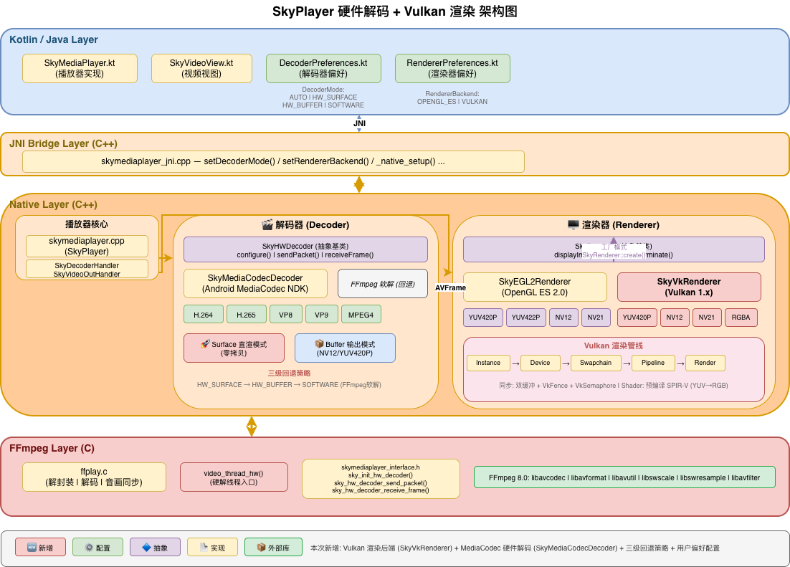
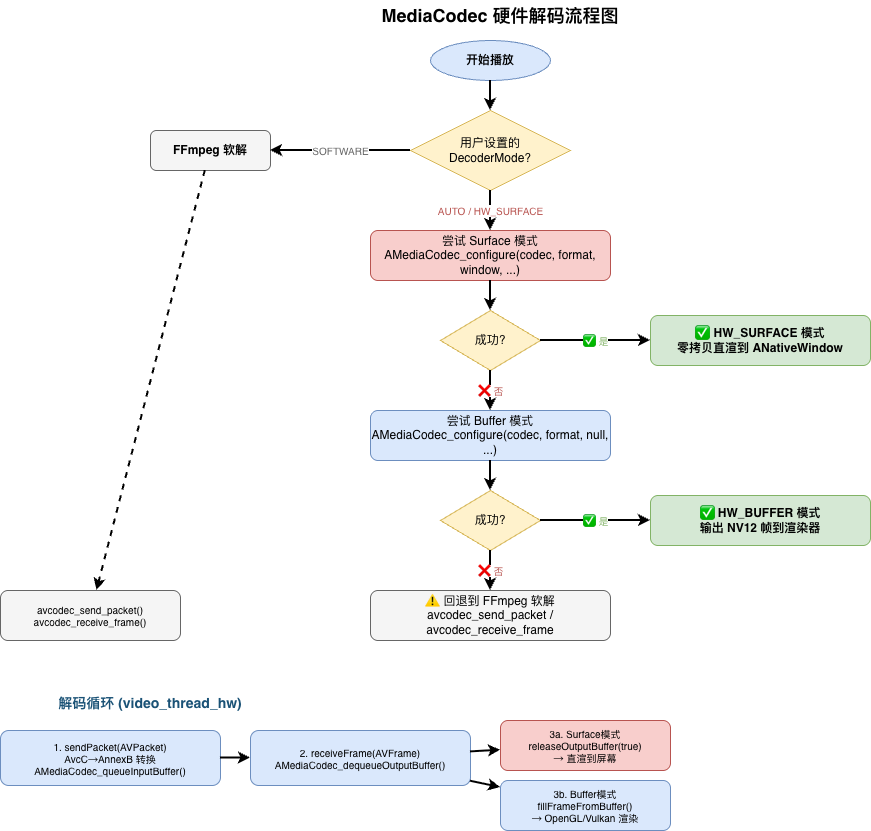
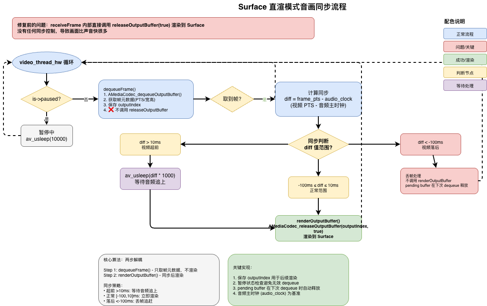
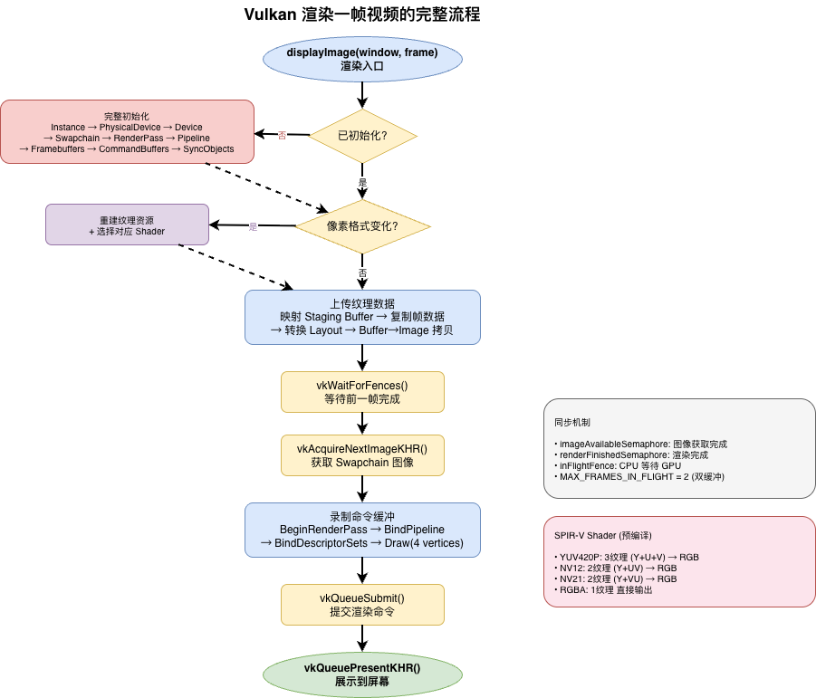

## SkyPlayer 硬件解码 + Vulkan 渲染后端

> 本文档详细说明 SkyPlayer 引入 Android MediaCodec 硬件解码和 Vulkan 渲染后端的完整实现方案，包括架构设计、三级回退策略、Surface 直渲音画同步修复、Vulkan 渲染管线初始化和渲染流程。

### 📋 目录

- [为什么需要硬件解码和 Vulkan 渲染？](#-为什么需要硬件解码和-vulkan-渲染)
- [功能概述](#-功能概述)
- [架构设计](#-架构设计)
- [MediaCodec 硬件解码](#-mediacodec-硬件解码)
- [Surface 直渲音画同步](#-surface-直渲音画同步)
- [Vulkan 渲染后端](#-vulkan-渲染后端)
- [新增文件清单](#-新增文件清单)
- [关键设计决策](#-关键设计决策)

### 🎯 为什么需要硬件解码和 Vulkan 渲染？

#### 移动端视频播放的挑战

随着 4K/8K 超高清视频的普及和移动设备性能需求的不断提升，传统的软件解码方案面临着严峻挑战：

- **CPU 占用过高**：纯软解 1080p H.264 视频时，CPU 占用可达 100% 以上，导致设备发热严重
- **功耗问题突出**：高 CPU 占用直接导致电池续航大幅下降，影响用户体验
- **4K 视频吃力**：软解 4K 视频时，大多数移动设备根本无法流畅播放，帧率严重下降
- **多任务场景受限**：高 CPU 占用使应用无法同时进行其他任务，如后台下载、数据处理等

#### 硬件解码的价值

现代移动 SoC（如高通 Snapdragon、联发科 Dimensity、苹果 A 系列）都内置了专用视频解码硬件单元：

- **专用硬件加速**：利用 SoC 内置的 VPU（Video Processing Unit），解码效率提升 10-100 倍
- **CPU 占用大幅降低**：从 100%+ 降到 5% 以下，释放 CPU 资源用于其他任务
- **功耗显著降低**：专用硬件功耗仅为 CPU 软解的 1/10，大幅提升续航
- **支持更高分辨率**：轻松应对 4K/8K 超高清视频播放
- **发热量大幅减少**：降低设备温度，提升用户舒适度

#### Vulkan 渲染的价值

相比传统的 OpenGL ES 2.0，Vulkan 作为下一代图形 API 带来了革命性优势：

| 对比维度 | OpenGL ES 2.0 | Vulkan |
|---------|--------------|--------|
| **API 开销** | 驱动层隐式状态管理，开销高 | **显式控制，零驱动开销** |
| **多线程** | 单线程限制，无法充分利用多核 | **原生多线程支持**，并行录制命令 |
| **内存管理** | 驱动自动管理，内存浪费严重 | **精确控制，减少浪费** |
| **管线状态** | 运行时编译 GLSL Shader，启动慢 | **预编译 SPIR-V**，零编译开销 |
| **同步控制** | 隐式同步，无法精确控制 | **显式信号量+栅栏**，精确同步 |
| **未来趋势** | 逐步淘汰 | **Android 推荐**，主流方向 |

#### SkyPlayer 的解决方案

SkyPlayer 采用了业界领先的 **MediaCodec 硬件解码 + Vulkan 渲染 + 三级回退** 方案：

- **MediaCodec 硬件解码**：利用 Android NDK MediaCodec API，直接调用 SoC 专用解码硬件
- **Vulkan 渲染后端**：采用 Vulkan 进行硬件加速渲染，性能超越 OpenGL ES
- **三级回退策略**：Surface 直渲染 → Buffer 输出 → FFmpeg 软解，确保任何设备都能正常播放
- **零拷贝优化**：Surface 直渲染模式下，解码帧直接输出到 Surface，无需 CPU 参与
- **音画同步修复**：针对 Surface 直渲染模式特有的音画同步问题，实现了两步流程解决方案

这套方案在保证兼容性的前提下，最大化了性能和能效，为用户提供流畅、低功耗的视频播放体验。

### 📋 功能概述

| 功能 | 说明 | 核心文件 |
|------|------|----------|
| **MediaCodec 硬解** | 利用 Android 硬件加速解码 H.264/H.265 等视频 | `sky_mediacodec_decoder.cpp` |
| **Vulkan 渲染** | 基于 Vulkan API 的高性能视频渲染管线 | `sky_vk_renderer.cpp` |
| **三级回退策略** | HW_SURFACE → HW_BUFFER → SOFTWARE 自动降级 | `skymediaplayer.cpp` |
| **渲染后端切换** | 运行时切换 OpenGL ES / Vulkan | `skyrenderer.cpp` |

### 🏗️ 架构设计

> 架构图见 [hw_decode_vulkan_render.drawio](hw_decode_vulkan_render.drawio)（第 1 页）

整体架构延续 SkyPlayer 四层设计，新增部分以 🆕 标注：



---

## 🎬 MediaCodec 硬件解码

### 为什么需要硬件解码？

| 对比维度 | FFmpeg 软解 | MediaCodec 硬解 |
|---------|------------|----------------|
| **CPU 占用** | 高（单核 100%+） | **极低（< 5%）** |
| **功耗** | 高 | **低（专用硬件）** |
| **4K 解码** | 吃力 | **流畅** |
| **电池续航** | 差 | **好** |
| **兼容性** | 最好 | 依赖设备 |

### 抽象设计

采用**抽象基类 + 工厂模式**，为未来扩展 iOS VideoToolbox 预留接口：

```cpp
// sky_hw_decoder.h - 跨平台硬件解码器抽象
class SkyHWDecoder {
public:
    virtual bool configure(AVCodecParameters *codecpar, void *surface) = 0;
    virtual bool start() = 0;
    virtual int sendPacket(AVPacket *packet) = 0;
    virtual int receiveFrame(AVFrame *frame) = 0;
    virtual void flush() = 0;
    virtual void stop() = 0;
    virtual void release() = 0;

    // 工厂方法：根据平台自动创建
    static std::unique_ptr<SkyHWDecoder> create();
};
```

### 三级回退策略

SkyPlayer 实现了**自动三级回退**，确保在任何设备上都能正常播放：



**核心实现**：

```cpp
// sky_mediacodec_decoder.cpp
bool SkyMediaCodecDecoder::configure(AVCodecParameters *codecpar, void *surface) {
    auto *window = reinterpret_cast<ANativeWindow*>(surface);

    // 1. 优先尝试 Surface 直渲（零拷贝）
    if (window && tryConfigureSurface(codecpar, window)) {
        return true;
    }

    // 2. 回退到 Buffer 模式（取出 NV12 帧）
    if (tryConfigureBuffer(codecpar)) {
        return true;
    }

    // 3. 都失败，上层回退到 FFmpeg 软解
    return false;
}
```

### 解码一帧的完整流程

#### 送入数据

```cpp
int SkyMediaCodecDecoder::sendPacket(AVPacket *packet) {
    // 1. AvcC/HvcC → Annex-B 格式转换（如需要）
    if (needsAnnexBConversion_) {
        convertPacketToAnnexB(packet->data, packet->size, annexBBuffer);
    }

    // 2. 获取输入 buffer
    ssize_t inputIndex = AMediaCodec_dequeueInputBuffer(codec_, DEQUEUE_TIMEOUT_US);

    // 3. 复制数据并提交
    uint8_t *inputBuffer = AMediaCodec_getInputBuffer(codec_, inputIndex, &size);
    memcpy(inputBuffer, sendData, sendSize);
    AMediaCodec_queueInputBuffer(codec_, inputIndex, 0, sendSize, pts, 0);

    return 0;
}
```

#### 获取解码帧

```cpp
int SkyMediaCodecDecoder::receiveFrame(AVFrame *frame) {
    ssize_t outputIndex = AMediaCodec_dequeueOutputBuffer(codec_, &bufferInfo, DEQUEUE_TIMEOUT_US);

    if (outputIndex >= 0) {
        if (isSurfaceMode()) {
            // Surface 模式：零拷贝直渲到屏幕
            AMediaCodec_releaseOutputBuffer(codec_, outputIndex, true);
            frame->pts = bufferInfo.presentationTimeUs;
        } else {
            // Buffer 模式：取出帧数据，交给渲染器
            uint8_t *outputBuffer = AMediaCodec_getOutputBuffer(codec_, outputIndex, &size);
            fillFrameFromBuffer(frame, outputBuffer, size, &bufferInfo, outputIndex);
            AMediaCodec_releaseOutputBuffer(codec_, outputIndex, false);
        }
        return 0;
    }
    return AVERROR(EAGAIN);
}
```

### 与 ffplay 的集成

硬解通过 C 接口与 ffplay 核心引擎对接，保持 ffplay.c 的独立性：

```c
// ffplay.c - stream_component_open() 中
if (decoder_mode != SKY_DECODER_MODE_SOFTWARE) {
    if (sky_init_hw_decoder(is->skyPlayer, codecpar)) {
        is->hw_decoder_active = 1;
        is->hw_surface_mode = sky_is_surface_mode(is->skyPlayer);
    }
    // 失败则自动走软解路径
}

// video_thread() 中根据标志选择路径
if (is->hw_decoder_active) {
    return video_thread_hw(is);  // 硬解线程
} else {
    return video_thread(is);     // 软解线程（原始 ffplay）
}
```

### 支持的编解码格式

| 编码格式 | MIME 类型 | 说明 |
|---------|----------|------|
| **H.264** | `video/avc` | 最常用 |
| **H.265/HEVC** | `video/hevc` | 高效编码 |
| **VP8** | `video/x-vnd.on2.vp8` | WebM |
| **VP9** | `video/x-vnd.on2.vp9` | YouTube |
| **MPEG-4** | `video/mp4v-es` | 兼容旧格式 |

---

## 🔄 Surface 直渲音画同步

### 问题描述

在硬件解码的 **Surface 直渲模式**（HW_SURFACE）下，存在**画面比声音快**的音画同步问题。

**根本原因**：MediaCodec 的 `receiveFrame()` 方法内部直接调用 `AMediaCodec_releaseOutputBuffer(index, true)` 将解码帧渲染到 Surface，这个渲染过程是**异步的**，且**没有音画同步控制**。视频帧一旦解码出来就立即显示，完全不考虑音频的播放进度。

### 修复方案：两步流程设计

将原本一次性完成"取帧+渲染"的 `receiveFrame()` 拆分为**两步**：

1. **`dequeueFrame()`**：仅从 MediaCodec 取出解码帧，**不渲染**
2. **`renderOutputBuffer()`**：在音画同步判断后，**按需渲染**到 Surface

**架构变更**：

```cpp
// sky_hw_decoder.h - 基类新增虚方法
class SkyHWDecoder {
public:
    // 仅取出帧，不渲染（Surface 模式 pendingOutputIndex_ 保存索引）
    virtual int dequeueFrame(AVFrame *frame) = 0;
    
    // 渲染已取出的帧（Buffer 模式无操作）
    virtual bool renderOutputBuffer() = 0;
};

// sky_mediacodec_decoder.h - 新增成员
class SkyMediaCodecDecoder : public SkyHWDecoder {
private:
    ssize_t pendingOutputIndex_ = -1;  // Surface 模式暂存的输出索引
};
```

**实现核心**：

```cpp
// sky_mediacodec_decoder.cpp
int SkyMediaCodecDecoder::dequeueFrame(AVFrame *frame) {
    ssize_t outputIndex = AMediaCodec_dequeueOutputBuffer(codec_, &bufferInfo, DEQUEUE_TIMEOUT_US);
    
    if (outputIndex >= 0) {
        if (isSurfaceMode()) {
            // Surface 模式：保存索引，暂不渲染
            pendingOutputIndex_ = outputIndex;
            frame->pts = bufferInfo.presentationTimeUs;
        } else {
            // Buffer 模式：取出数据到 frame
            uint8_t *outputBuffer = AMediaCodec_getOutputBuffer(codec_, outputIndex, &size);
            fillFrameFromBuffer(frame, outputBuffer, size, &bufferInfo, outputIndex);
            AMediaCodec_releaseOutputBuffer(codec_, outputIndex, false);
        }
        return 0;
    }
    return AVERROR(EAGAIN);
}

bool SkyMediaCodecDecoder::renderOutputBuffer() {
    if (isSurfaceMode() && pendingOutputIndex_ >= 0) {
        // Surface 模式：在此处渲染（由 ffplay 控制时机）
        AMediaCodec_releaseOutputBuffer(codec_, pendingOutputIndex_, true);
        pendingOutputIndex_ = -1;
        return true;
    }
    return false;  // Buffer 模式无需操作
}
```

### 同步策略

在 `ffplay.c` 的 `video_thread_hw()` 中，根据视频帧与音频时钟的偏差决定处理方式：

| 时间偏差 | 处理方式 | 说明 |
|---------|---------|------|
| **视频超前 > 10ms** | **等待** | `av_usleep(diff * 1000)` 等待音频追上 |
| **视频落后 > 100ms** | **丢帧** | 跳过该帧，直接调用 `renderOutputBuffer()` 消费但不显示 |
| **正常范围** | **显示** | 正常调用 `renderOutputBuffer()` 渲染 |

**关键代码**：

```c
// ffplay.c - video_thread_hw()
int video_thread_hw(void *arg) {
    VideoState *is = (VideoState *)arg;
    
    for (;;) {
        // 1. 暂停检查
        if (is->paused) {
            av_usleep(10000);  // 暂停时挂起解码线程
            continue;
        }
        
        // 2. 取出帧（不渲染）
        ret = sky_decoder_dequeue_frame(is->skyPlayer, frame);
        if (ret < 0) continue;
        
        // 3. 音画同步判断
        double diff = get_video_clock(is) - get_master_clock(is);
        
        if (diff > 0.010) {
            // 视频超前 > 10ms，等待
            av_usleep((int64_t)(diff * 1000000));
        } else if (diff < -0.100) {
            // 视频落后 > 100ms，丢帧
            sky_decoder_render_output_buffer(is->skyPlayer);  // 消费但不显示
            continue;  // 直接取下一帧
        }
        
        // 4. 正常渲染
        sky_decoder_render_output_buffer(is->skyPlayer);
    }
}
```

### 暂停处理

在 `dequeueFrame()` 之前检查 `is->paused` 标志，暂停时**挂起解码线程**，避免继续取帧浪费资源：

```c
// 暂停检查
if (is->paused) {
    av_usleep(10000);  // 10ms 轮询间隔
    continue;
}
```

### 完整调用流程



### 关键修改文件

| 文件 | 修改内容 |
|------|---------|
| `sky_hw_decoder.h` | 基类新增 `dequeueFrame()` / `renderOutputBuffer()` 虚方法 |
| `sky_mediacodec_decoder.h` | 新增 `pendingOutputIndex_` 成员 |
| `sky_mediacodec_decoder.cpp` | 实现两步流程（dequeueFrame 暂存，renderOutputBuffer 渲染） |
| `skymediaplayer.h/cpp` | `SkyDecoderHandler` 转发调用 + C 接口封装 |
| `skymediaplayer_interface.h` | 新增 C 接口声明 |
| `ffplay.c` | `video_thread_hw()` 使用两步流程 + 同步策略 |

---

## 🖥️ Vulkan 渲染后端

### 为什么引入 Vulkan？

| 对比维度 | OpenGL ES 2.0 | Vulkan |
|---------|--------------|--------|
| **API 开销** | 驱动层隐式状态管理 | **显式控制，零驱动开销** |
| **多线程** | 单线程限制 | **原生多线程支持** |
| **内存管理** | 驱动自动管理 | **精确控制，减少浪费** |
| **管线状态** | 运行时编译 Shader | **预编译 SPIR-V** |
| **同步控制** | 隐式同步 | **显式信号量+栅栏** |
| **未来趋势** | 逐步淘汰 | **Android 推荐** |

### 渲染器切换机制

采用**工厂模式**，通过统一的 `SkyRenderer` 基类实现透明切换：

```cpp
// skyrenderer.cpp
std::unique_ptr<SkyRenderer> SkyRenderer::create(RendererBackend backend) {
    switch (backend) {
        case RendererBackend::VULKAN:
            return std::make_unique<SkyVkRenderer>();
        case RendererBackend::OPENGL_ES:
        default:
            return std::make_unique<SkyEGL2Renderer>();
    }
}
```

上层调用完全一致，无需关心底层实现：

```cpp
// 统一接口
renderer->displayImage(window, frame);  // OpenGL ES 或 Vulkan 自动分发
```

### Vulkan 渲染管线初始化

完整的 Vulkan 初始化流程：



**关键配置**：

```cpp
// sky_vk_renderer.cpp
void SkyVkRenderer::createSwapchain() {
    // 优先选择 MAILBOX 呈现模式（三重缓冲，低延迟）
    VkPresentModeKHR presentMode = VK_PRESENT_MODE_MAILBOX_KHR;
    // 格式优先 R8G8B8A8_UNORM
    VkFormat format = VK_FORMAT_R8G8B8A8_UNORM;
}
```

### 渲染一帧视频的完整流程


### 支持的像素格式与 Shader

所有 Shader 均为**预编译 SPIR-V 字节码**，存储在 `sky_vk_shaders.h` 中，避免运行时编译开销：

| 像素格式 | 纹理数量 | Vulkan 格式 | Shader 功能 |
|----------|---------|-------------|------------|
| **YUV420P** | 3（Y + U + V） | `R8_UNORM` × 3 | YUV → RGB 矩阵转换 |
| **NV12** | 2（Y + UV） | Y: `R8`, UV: `R8G8` | YUV → RGB（UV 交错） |
| **NV21** | 2（Y + VU） | Y: `R8`, VU: `R8G8` | YUV → RGB（VU 交错） |
| **RGBA** | 1 | `R8G8B8A8_UNORM` | 直接输出 |

### 同步机制

采用**双缓冲 + 信号量 + 栅栏**的经典 Vulkan 同步方案（详见上方 Vulkan 渲染流程图）。

---

## 📁 新增文件清单

### 硬件解码相关

| 文件 | 说明 |
|------|------|
| `player/decoder/sky_hw_decoder.h/cpp` | 硬件解码器抽象基类 |
| `player/decoder/sky_mediacodec_decoder.h/cpp` | Android MediaCodec 解码器实现（794 行） |
| `player/decoder/sky_decoder_types.h` | 解码模式枚举定义 |
| `DecoderPreferences.kt` | 解码器偏好持久化 |

### Vulkan 渲染相关

| 文件 | 说明 |
|------|------|
| `player/renderer/sky_vk_renderer.h/cpp` | Vulkan 渲染器实现（1919 行） |
| `player/renderer/sky_vk_shaders.h` | 预编译 SPIR-V Shader（295 行） |
| `player/renderer/sky_renderer_types.h` | 渲染后端枚举定义 |
| `RendererPreferences.kt` | 渲染器偏好持久化 |

### 修改的核心文件

| 文件 | 变更 |
|------|------|
| `ffplay.c` | 新增 `video_thread_hw()` 硬解线程入口 + Surface 直渲音画同步 |
| `player/skymediaplayer.cpp/h` | 新增 `SkyDecoderHandler` 管理器 + C 接口封装 |
| `player/renderer/skyrenderer.cpp/h` | 新增 Vulkan 后端工厂分支 |
| `skymediaplayer_jni.cpp` | 新增 `setDecoderMode` / `setRendererBackend` JNI 方法 |
| `SkyMediaPlayer.kt` | 新增解码器和渲染器配置接口 |
| `SkyVideoView.kt` | 新增配置透传 |

---

## 🔑 关键设计决策

### 1. 为什么用 NDK MediaCodec 而不是 Java MediaCodec？

- **避免 JNI 频繁调用**：解码每帧都需要调用，NDK 直接在 C++ 层完成
- **零拷贝 Surface 模式**：NDK 可直接传递 `ANativeWindow`
- **线程安全**：无需跨 JNI 边界管理线程

### 2. 为什么 Shader 使用预编译 SPIR-V？

- **零运行时编译开销**：OpenGL ES 需要运行时编译 GLSL
- **跨设备一致性**：避免不同 GPU 驱动的 GLSL 编译差异
- **更快启动**：首帧渲染更快

### 3. 为什么需要 AvcC → Annex-B 转换？

- **MP4 容器**使用 AvcC 格式（length-prefixed NAL）
- **MediaCodec** 要求 Annex-B 格式（start-code-prefixed: `00 00 00 01`）
- 自动检测并转换，对上层透明

---

## 🙏 致谢

- [FFmpeg](https://ffmpeg.org/) - 多媒体处理基石
- [Vulkan](https://www.vulkan.org/) - 下一代图形 API
- [Android NDK MediaCodec](https://developer.android.com/ndk/reference/group/media)